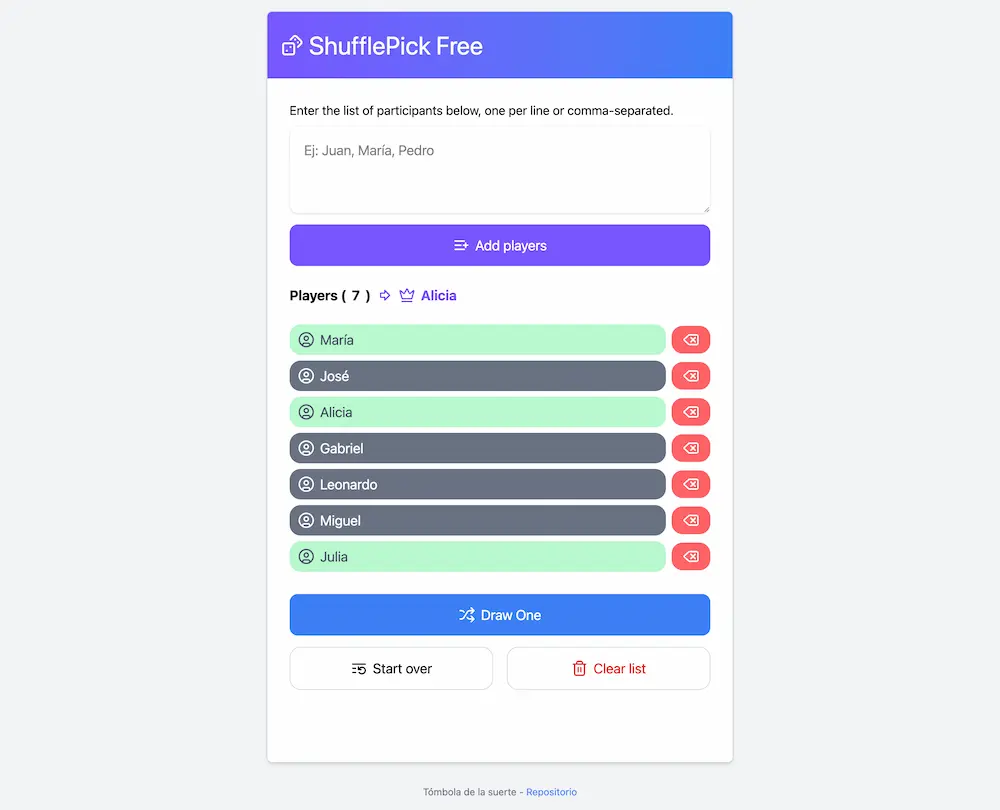

# Shuffle Pick Free App



Esta aplicación desarrollada principalmente con [Astro](https://astro.build/) + [TypeScript](https://github.com/microsoft/TypeScript) cumple la función de generar una lista que el usuario ingresa separada por comas o saltos de línea en el cuadro de texto para luego poder seleccionar un elemento al azar de esa lista ingresada.

Simple para cuando uno necesita obtener un elemento al azar de una lista.

### Random... qué tan random?
Bueno, [JavaScript](https://developer.mozilla.org/es/docs/Web/JavaScript) tiene objetos globales con funciones utilitarias muy interesantes como lo es [Math](https://developer.mozilla.org/en-US/docs/Web/JavaScript/Reference/Global_Objects/Math) y su método [Random](https://developer.mozilla.org/en-US/docs/Web/JavaScript/Reference/Global_Objects/Math/random). Con esto se logra obtener un valor aleatorio de la lista ingresada por el usuario. La función que ejecuta este proceso es la siguiente:

```javascript
export const getRandomPlayer = (): Player | null => {
    // obtenemos la lista de ID's del Record.
    const idPlayers = Object.keys(players.get());

    // Items ya seleccionados no participan.
    const idFiltered = idPlayers.filter(id => !players.get()[id].selected); 

    // Si no quedan elementos por sortear devolvemos un null temprano
    if (!idFiltered.length) return null;

    // Por el contrario, obtenemos un valor al azar con la clase Math y el métdo Random.
    const playerSelected = idFiltered[Math.floor(Math.random() * idFiltered.length)];
    const playerPicked = players.get()[playerSelected];

    // Actualizamos el estado.
    togglePlayerSelected(playerSelected);
    setLastPlayerSelected(playerPicked);

    // Se retorna el registro.
    return playerPicked;
}
```

## Simple aplicación?

La verdad es que se ve simple, pero tiene cierta complejidad y más que nada representa un desafío porque quería practicar usando Astro con la integración de React.js para sus islas y nanostore para compartir el estado entre estas islas de React.js lo que me resultó muy entretenido realizar.